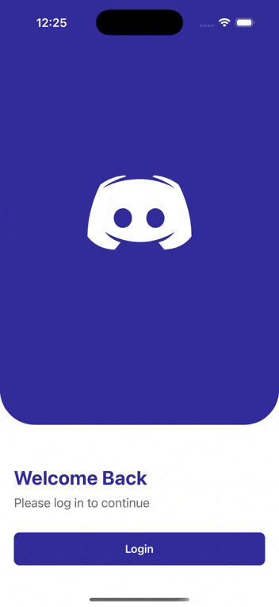

# super-app-mvp

A demo Super App built with **Re.Pack v5** and **Rspack** using the `moduleFederation` plugin (v2).  
The project demonstrates authentication, notifications, localization, and integration of mini apps within a host application.

---

## Main Features

1. Super App using Re.Pack v5 and Rspack with Module Federation Plugin v2  
2. Authentication using Keycloak PKCE (via `react-native-app-auth`)  
3. Notifications using Notifee (demo: notification triggered every 1 min)  
4. Localization in English and Arabic using i18n with full RTL support  
5. Mini App architecture (e.g., Notes app) dynamically loaded via config and single loader  

---

## Demo



---

## Folder Structure
superAppMonoRepo
packages
host
src
screens
services
components
navigation
store
theme
assets
notes (mini app)
src
scripts

- **host**: The main super app container (includes navigation, authentication, notifications, localization).  
- **notes**: Example mini app (not a standalone app, works only within host).  
- **scripts**: Helper scripts to run and manage the monorepo.  

---

## Setup Keycloak

1. Run Keycloak via Docker:

```bash
docker run -p 8080:8080 \
  -e KEYCLOAK_ADMIN=admin \
  -e KEYCLOAK_ADMIN_PASSWORD=admin \
  quay.io/keycloak/keycloak:20.0.1 start-dev
```
1. Configure a client with PKCE enabled.
2. The host app uses react-native-app-auth for authentication with Keycloak.
3. Redux is used to store access/ID tokens for session management.


Running the Project

Install dependencies and start all apps:
```
yarn
yarn start
```

Run on iOS:
```
yarn ios
```

Run on Android:
```
yarn android
```

## Notes Mini App

- Lives under `packages/notes`  
- Not a standalone app — works only when integrated with the host app  
- Configured through a mini app config file, allowing all mini apps to be registered in one place for easier scaling  
- Loaded dynamically by the single `MiniAppLoader`  

## Notifications

- Notifications are powered by **Notifee**  
- In the demo, a notification is scheduled every 1 minute  
- For production, **Firebase Cloud Messaging (FCM)** integration is recommended  
- Note: FCM setup requires configuration in the Apple Developer Console, which is not included in this demo project  

## Key Improvements (Future Work)

- Replace demo Notifee schedule with **Firebase Cloud Messaging** for real push notifications  
- Add more example mini apps to demonstrate scalability  
- Implement advanced session handling and token refresh with Keycloak
